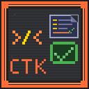

<p align="center">
  
</p>

<h1 align="center">CodingTestKit for VS Code</h1>
<p align="center">
  An all-in-one VS Code extension to <b>fetch</b>, <b>test</b>, and <b>submit</b> algorithm problems — all without leaving your editor.<br/>
  <b>Programmers</b> · <b>SWEA</b> · <b>LeetCode</b> · <b>Codeforces</b>
</p>

<p align="center">
  <a href="#english"><b>English</b></a> &nbsp;|&nbsp; <a href="#korean"><b>한국어</b></a>
</p>

---

<h1 id="english">English</h1>

## Why?

Preparing for coding tests has always been cumbersome — read the problem in a browser, write code in the editor, switch back to the browser to submit, and repeat.

CodingTestKit was built to **replicate the real exam environment inside VS Code**:

- **Exam Mode**: Disable autocomplete & syntax highlighting, block external paste, detect focus loss — practice under real test conditions
- **Performance Metrics**: Show execution time (ms) and memory usage per test case
- **Timer**: Stopwatch, circular dial countdown timer, progress bar, digital clock
- **All-in-One**: Fetch, code, test, and submit without leaving the editor
- **Problem Translation**: One-click Korean ↔ English translation with caching and rate limit protection
- **GitHub Push**: Auto-push accepted solutions to GitHub

## Supported Platforms

| Platform | Fetch | Test | Submit | Search | Random | My Solved |
|----------|:-----:|:----:|:------:|:------:|:------:|:---------:|
| **Programmers** | O | O | O | O | O | - |
| **SWEA** | O | O | O | O | O | - |
| **LeetCode** | O | O | O | O | O | O |
| **Codeforces** | O | O | O | O | O | O |

## Supported Languages

| Language | Programmers | SWEA | LeetCode | Codeforces |
|----------|:-----------:|:----:|:--------:|:----------:|
| Java | O | O | O | O |
| Python | O | O | O | O |
| C++ | O | O | O | O |
| Kotlin | O | X | O | O |
| JavaScript | - | - | O | O |

---

## Features

> Click any feature below to jump to the detailed section.

| # | Feature | Description |
|:-:|---------|-------------|
| 1 | [**Fetch Problems**](#fetch-problems) | Fetch problem description & test cases from 4 platforms |
| 2 | [**Problem View & Translation**](#problem-view--translation) | View problems in-editor with one-click KR↔EN translation + LaTeX math rendering |
| 3 | [**Local Test Execution**](#local-test-execution) | Run all test cases locally with execution time & memory metrics |
| 4 | [**Login & Submit**](#login--submit) | Submit code directly via built-in browser with auto language selection |
| 5 | [**Problem Search**](#problem-search) | Search problems on LeetCode, Codeforces, SWEA, Programmers |
| 6 | [**Random Problem Picker**](#random-problem-picker) | Pick random problems with tier/difficulty/tag filters |
| 7 | [**Code Editor**](#code-editor) | Auto-generated boilerplate code per platform & language |
| 8 | [**Code Templates**](#code-templates) | Save & reuse frequently used code snippets with CodeMirror syntax highlighting |
| 9 | [**Timer**](#timer) | Stopwatch with laps + countdown with circular dial, progress bar, digital clock |
| 10 | [**Settings & Exam Mode**](#settings--exam-mode) | One-click exam mode: block paste, disable autocomplete & syntax highlighting, focus alert |
| 11 | [**GitHub Integration**](#github-integration) | Auto-push accepted solutions to GitHub |
| 12 | [**Internationalization**](#internationalization-i18n) | Full Korean / English UI support |

---

### Fetch Problems

<p align="center"></p>

Select the platform and language, enter a problem number, and the problem description and test cases are automatically extracted.

- **Programmers**: Number after `/lessons/` in URL (e.g., `12947`)
- **SWEA**: Enter problem number or paste URL
- **LeetCode**: Enter number, slug, or URL (e.g., `1`, `two-sum`, full URL)
- **Codeforces**: Enter contest + problem (e.g., `1A`, `1000B`, or URL)

When a problem is fetched, a folder is automatically created with a code file and README.md (problem description).

<p align="right"><a href="#features">Back to Features</a></p>

---

### Problem View & Translation

View the problem description, I/O format, and examples directly in the sidebar panel. Mathematical formulas (LaTeX) are rendered natively using KaTeX.

#### Problem Translation (KR ↔ EN)

- **Toggle Translation**: Click the Translate button to switch between original and translated text
- **Auto Language Detection**: Automatically detects Korean/English and translates to the other language
- **Translation Caching**: Translated results are cached — no repeated API calls for the same problem
- **Rate Limit Protection**: Built-in request throttling and exponential backoff retry

<p align="right"><a href="#features">Back to Features</a></p>

---

### Local Test Execution

Write your code and click **Run All** to execute all test cases and see PASS/FAIL results instantly. Each test case shows **execution time (ms)** and **memory usage (KB/MB)**.

Failed cases are highlighted in red and auto-expanded. Programmers and LeetCode solution functions are automatically wrapped for testing.

<p align="right"><a href="#features">Back to Features</a></p>

---

### Login & Submit

Log in to each platform via the built-in browser and submit your code directly. The language dropdown is **automatically selected** to match your code.

For LeetCode and Codeforces, the problem page opens in your default browser.

<p align="right"><a href="#features">Back to Features</a></p>

---

### Problem Search

#### LeetCode
- **Keyword Search**: Search by title or keyword
- **Difficulty Filter**: Filter by Easy, Medium, Hard
- **Tag Filter**: Filter by algorithm tags (Array, DP, Graph, etc.)

#### Codeforces
- **Tag Filter**: Filter by algorithm tags with Korean translation
- **Rating Range**: Filter by problem rating
- **Solved Count**: Filter by minimum solved count

#### Programmers & SWEA
- **Level/Difficulty Filter**: Filter by level or difficulty tier
- **Language Filter**: Filter by programming language
- **Category Filter**: Filter by exam collection or category

<p align="right"><a href="#features">Back to Features</a></p>

---

### Random Problem Picker

<p align="center"></p>

#### LeetCode
- **Difficulty Checkboxes**: Select multiple difficulties (Easy, Medium, Hard)
- **Tag Chips**: Select/remove tags as chips (Array, DP, Graph, etc.)
- **Accepted Filter**: Exclude obscure problems by minimum accepted count (e.g., ≥1000)
- **Solved Filter**: All / Exclude my solved / Only my solved

#### Codeforces
- **Rating Range**: Filter by min/max problem rating
- **Tag Chips**: Algorithm tags with Korean translation
- **Solved Count Filter**: Exclude problems with few solvers

#### SWEA
- **Difficulty Filter**: D1–D8 tier selection
- **Language Filter**: Filter by C/C++, Java, Python
- **Status Filter**: All / Unsolved / Solved only

#### Programmers
- **Category Filter**: Filter by exam collection (PCCE, PCCP, Kakao, etc.)
- **Level Filter**: Lv. 0–5 selection
- **Language & Status Filters**

<p align="right"><a href="#features">Back to Features</a></p>

---

### Code Editor

When a problem is fetched, boilerplate code is auto-generated so you can start coding immediately.

<p align="right"><a href="#features">Back to Features</a></p>

---

### Code Templates

<p align="center"></p>

Save frequently used boilerplate as templates for quick access. Syntax-highlighted preview with CodeMirror editor included.

<p align="right"><a href="#features">Back to Features</a></p>

---

### Timer

<p align="center"></p>

Provides a **Stopwatch** and a **Countdown Timer**.

- **Stopwatch**: Lap records with memo
- **Countdown**: 3 display modes selectable via checkboxes
  - **Circular Dial Timer**: Remaining time shown as a colored arc, with urgency color changes
  - **Digital Clock**: Large numerical time display
  - **Progress Bar**: Linear progress indicator
- Preset buttons for 30min, 1hr, 2hr, 3hr
- Notification when time's up

<p align="right"><a href="#features">Back to Features</a></p>

---

### Settings & Exam Mode

<p align="center"></p>

- **Auto Complete ON/OFF**: Toggle code auto-completion, snippets, parameter hints, and inline suggestions
- **Syntax Highlighting ON/OFF**: Disable all token colors and semantic highlighting
- **Diagnostics OFF**: Hide code error/warning squiggles
- **CodeLens OFF**: Hide "N references" hints above functions
- **Block External Paste**: Block pasting text copied from outside VS Code
- **Focus Alert**: Notify when VS Code window loses focus
- **Language**: Switch between Korean / English

One-click **Exam Mode** enables all restrictions; **Normal Mode** disables them all.

<p align="right"><a href="#features">Back to Features</a></p>

---

### GitHub Integration

Push your accepted solutions to GitHub automatically.

- **One-Click Login**: Log in to GitHub via built-in browser — token is auto-generated and saved
- **Repo Selector**: Choose from your repositories via dropdown after login
- **Auto Push**: Automatically push code to GitHub when your submission is accepted
- **Manual Push**: Click the GitHub button to push anytime
- **Smart Detection**: Only pushes on "Accepted" — wrong answers are never pushed
- **All Platforms**: Works with Programmers, SWEA, LeetCode, and Codeforces
- **Structured Commits**: `[Platform #ID] Problem Title (Language)` format with README

Setup: Settings > GitHub Integration > Click "GitHub Login" and select your repository.

<p align="right"><a href="#features">Back to Features</a></p>

---

### Internationalization (i18n)

Switch between **Korean / English** in settings. All UI text — buttons, labels, placeholders, toast messages, settings help text, and error messages — is displayed in the selected language.

<p align="right"><a href="#features">Back to Features</a></p>

---

## Installation

### VS Code Marketplace
1. Open VS Code > Extensions (`Ctrl+Shift+X`)
2. Search **"CodingTestKit"** and install

### Cursor / VSCodium / code-server (Open VSX)
Available on [Open VSX Registry](https://open-vsx.org/extension/codingtestkit/codingtestkit) — open the Extensions panel in **Cursor**, **VSCodium**, **code-server**, or **Gitpod**, search **"CodingTestKit"**, and install.

### Manual Install
1. Download `.vsix` from [Releases](https://github.com/dj258255/codingtestkit-vscode/releases)
2. VS Code > Extensions > `...` menu > Install from VSIX

## Quick Start

1. Click the **CodingTestKit** icon in the Activity Bar (left sidebar)
2. Select platform and language
3. Enter problem ID and click **Fetch**
4. Write code, click **Run All**
5. Click **Submit** to submit via built-in browser

## Requirements

- VS Code 1.85.0+
- Language compilers/interpreters for test execution:
  - Java: JDK 11+
  - Python: Python 3.8+
  - C++: g++ or clang++
  - Kotlin: kotlinc
  - JavaScript: Node.js

## Build from Source

```bash
npm install
npm run compile
```

To create VSIX package:
```bash
npx @vscode/vsce package
```

## Feedback

Found a bug or have a feature suggestion? I'd love to hear from you!

- **Quick form (recommended):** [https://forms.gle/Qqi5gDoHSi2HU1Xs5](https://forms.gle/Qqi5gDoHSi2HU1Xs5)
- GitHub Issues: [Open an issue](https://github.com/dj258255/codingtestkit-vscode/issues)

You can also access the feedback form directly from the **Settings** tab inside the extension.

---

<h1 id="korean">한국어</h1>

## 왜 만들었나?

코딩테스트를 준비하면서 항상 불편했습니다. 문제를 풀려면 브라우저에서 문제를 읽고, 에디터에서 코드를 작성하고, 다시 브라우저로 돌아가 제출하고... 이 과정을 반복해야 했습니다.

CodingTestKit은 **실제 시험 환경을 VS Code 안에서 그대로 재현**하기 위해 만들었습니다:

- **시험 모드**: 자동완성과 구문 강조를 끄고, 외부 붙여넣기 차단과 포커스 이탈 감지까지 실전과 동일한 환경에서 연습
- **실행 시간 & 메모리 측정**: 테스트 케이스별 실행 시간(ms)과 메모리 사용량(KB/MB)을 표시
- **타이머**: 스톱워치, 원형 다이얼 카운트다운 타이머, 프로그레스 바, 디지털 시계
- **올인원**: 문제 읽기, 코드 작성, 테스트, 제출까지 에디터를 벗어나지 않고 전부 해결
- **문제 번역**: 한 클릭으로 한국어 ↔ 영어 번역 (캐싱 및 rate limit 보호 내장)
- **GitHub 연동**: 채점 통과 시 자동으로 GitHub에 푸시

## 지원 플랫폼

| 플랫폼 | 문제 가져오기 | 로컬 테스트 | 코드 제출 | 검색 | 랜덤 | 내 풀이 |
|--------|:---------:|:---------:|:--------:|:----:|:----:|:------:|
| **프로그래머스** | O | O | O | O | O | - |
| **SWEA** | O | O | O | O | O | - |
| **LeetCode** | O | O | O | O | O | O |
| **Codeforces** | O | O | O | O | O | O |

## 지원 언어

| 언어 | 프로그래머스 | SWEA | LeetCode | Codeforces |
|------|:----------:|:----:|:--------:|:----------:|
| Java | O | O | O | O |
| Python | O | O | O | O |
| C++ | O | O | O | O |
| Kotlin | O | X | O | O |
| JavaScript | - | - | O | O |

---

## 주요 기능

> 아래 기능을 클릭하면 해당 섹션으로 이동합니다.

| # | 기능 | 설명 |
|:-:|------|------|
| 1 | [**문제 가져오기**](#문제-가져오기) | 4개 플랫폼에서 문제 설명 & 테스트 케이스 자동 추출 |
| 2 | [**문제 보기 & 번역**](#문제-보기--번역) | 에디터 내에서 문제 확인 + 한/영 원클릭 번역 + LaTeX 수식 렌더링 |
| 3 | [**로컬 테스트 실행**](#로컬-테스트-실행) | 모든 테스트 케이스 로컬 실행 + 실행 시간 & 메모리 측정 |
| 4 | [**로그인 & 제출**](#로그인--제출) | 내장 브라우저로 코드 제출 + 언어 자동 선택 |
| 5 | [**문제 검색**](#문제-검색) | LeetCode, Codeforces, SWEA, 프로그래머스 문제 검색 |
| 6 | [**랜덤 문제 뽑기**](#랜덤-문제-뽑기) | 티어/난이도/태그 필터로 랜덤 문제 추천 |
| 7 | [**코드 에디터**](#코드-에디터) | 플랫폼 & 언어별 보일러플레이트 코드 자동 생성 |
| 8 | [**코드 템플릿**](#코드-템플릿) | 자주 쓰는 코드 스니펫 저장 & 재사용 (CodeMirror 구문 강조 미리보기) |
| 9 | [**타이머**](#타이머) | 스톱워치 + 원형 다이얼/프로그레스 바/디지털 시계 카운트다운 |
| 10 | [**설정 & 시험 모드**](#설정--시험-모드) | 원클릭 시험 모드: 붙여넣기 차단, 자동완성 & 구문 강조 끄기, 포커스 감지 |
| 11 | [**GitHub 연동**](#github-연동) | 맞은 문제 자동 GitHub 푸시 |
| 12 | [**다국어 지원**](#다국어-지원-i18n) | 한국어 / English UI 완전 지원 |

---

### 문제 가져오기

<p align="center"></p>

플랫폼과 언어를 선택하고 문제 번호만 입력하면 문제 설명, 테스트 케이스가 자동으로 추출됩니다.

- **프로그래머스**: URL의 `/lessons/` 뒤 숫자 (예: `12947`)
- **SWEA**: 문제 번호 또는 URL 붙여넣기
- **LeetCode**: 문제 번호, slug, 또는 URL 입력 (예: `1`, `two-sum`, URL)
- **Codeforces**: 대회번호 + 문제 (예: `1A`, `1000B`, 또는 URL)

문제를 가져오면 프로젝트 내에 폴더가 자동 생성되고, 코드 파일과 README.md(문제 설명)가 만들어집니다.

<p align="right"><a href="#주요-기능">기능 목록으로</a></p>

---

### 문제 보기 & 번역

사이드바 패널에서 문제 설명, 입출력 형식, 예제를 바로 확인할 수 있습니다. 수학 공식(LaTeX)은 KaTeX로 자동 렌더링됩니다.

#### 문제 번역 (한 ↔ 영)

- **토글 번역**: 번역 버튼 클릭으로 원문/번역 전환
- **자동 언어 감지**: 한국어/영어를 자동 감지하여 반대 언어로 번역
- **번역 캐싱**: 번역 결과를 캐시하여 같은 문제를 다시 번역하지 않음
- **Rate Limit 보호**: 요청 간 딜레이 및 exponential backoff 재시도로 IP 차단 방지

<p align="right"><a href="#주요-기능">기능 목록으로</a></p>

---

### 로컬 테스트 실행

코드를 작성하고 **전체 실행**을 누르면 모든 테스트 케이스가 실행되어 PASS/FAIL 결과를 바로 확인할 수 있습니다. 각 테스트 케이스별로 **실행 시간(ms)**과 **메모리 사용량(KB/MB)**이 함께 표시됩니다.

FAIL인 케이스는 빨간색으로 표시됩니다. 프로그래머스와 LeetCode의 solution 함수도 자동으로 래핑하여 테스트합니다.

<p align="right"><a href="#주요-기능">기능 목록으로</a></p>

---

### 로그인 & 제출

내장 브라우저를 통해 각 플랫폼에 로그인하고, 코드를 직접 제출할 수 있습니다. 제출 시 코드 작성 언어에 맞춰 **언어 드롭다운이 자동 선택**됩니다.

LeetCode와 Codeforces는 기본 브라우저에서 문제 페이지가 열립니다.

<p align="right"><a href="#주요-기능">기능 목록으로</a></p>

---

### 문제 검색

#### LeetCode
- **키워드 검색**: 문제 제목이나 키워드로 검색
- **난이도 필터**: Easy, Medium, Hard 필터링
- **태그 필터**: Array, DP, Graph 등 알고리즘 태그로 필터링

#### Codeforces
- **태그 필터**: 알고리즘 태그 (한국어 번역 지원)
- **레이팅 범위**: 문제 레이팅으로 필터링
- **맞은 사람 수**: 최소 정답자 수 필터

#### 프로그래머스 & SWEA
- **레벨/난이도 필터**: 레벨 또는 난이도 티어로 필터
- **언어 필터**: 프로그래밍 언어로 필터
- **분류 필터**: 기출문제 모음, 카테고리로 필터

<p align="right"><a href="#주요-기능">기능 목록으로</a></p>

---

### 랜덤 문제 뽑기

<p align="center"></p>

#### LeetCode
- **난이도 체크박스**: Easy, Medium, Hard 중 원하는 난이도 복수 선택
- **태그 칩 선택**: Array, DP, Graph 등 태그를 칩으로 선택/제거
- **정답자 수 필터**: 정답자 N명 이상인 문제만 표시
- **풀이 필터**: 전체 / 내가 푼 문제 제외 / 내가 푼 문제에서만

#### Codeforces
- **레이팅 범위**: 최소/최대 레이팅 필터
- **알고리즘 태그 칩**: 한국어 번역 지원
- **맞은 사람 수 필터**

#### SWEA
- **난이도 필터**: D1~D8 티어 선택
- **언어 필터**: C/C++, Java, Python
- **풀이 상태 필터**: 전체 / 안 푼 문제 / 푼 문제만

#### 프로그래머스
- **분류 필터**: 기출문제 모음 (PCCE, PCCP, 카카오 등)
- **레벨 필터**: Lv. 0~5 선택
- **언어 & 풀이 상태 필터**

<p align="right"><a href="#주요-기능">기능 목록으로</a></p>

---

### 코드 에디터

문제를 가져오면 기본 코드가 자동 생성되어 에디터에서 바로 작성할 수 있습니다.

<p align="right"><a href="#주요-기능">기능 목록으로</a></p>

---

### 코드 템플릿

<p align="center"></p>

자주 쓰는 코드를 템플릿으로 저장해두면 빠르게 불러올 수 있습니다. CodeMirror 에디터로 구문 강조가 적용된 미리보기를 제공합니다.

<p align="right"><a href="#주요-기능">기능 목록으로</a></p>

---

### 타이머

<p align="center"></p>

**스톱워치**와 **카운트다운 타이머**를 제공합니다.

- **스톱워치**: 랩 기록과 메모 기능
- **카운트다운**: 3가지 표시 모드를 체크박스로 선택 가능
  - **원형 다이얼 타이머**: 남은 시간이 색상 아크로 표시, 시간 경과에 따라 색상 변화
  - **디지털 시계**: 큰 숫자로 남은 시간 표시
  - **프로그레스 바**: 막대형 진행률 표시
- 30분, 1시간, 2시간, 3시간 프리셋 버튼
- 시간 종료 시 알림

<p align="right"><a href="#주요-기능">기능 목록으로</a></p>

---

### 설정 & 시험 모드

<p align="center"></p>

- **자동완성 ON/OFF**: 코드 자동완성, 스니펫, 파라미터 힌트, 인라인 제안 제어
- **구문 강조 ON/OFF**: 토큰 색상 및 시맨틱 하이라이팅 비활성화
- **오류 검사 OFF**: 코드 오류/경고 밑줄 숨기기
- **사용위치 힌트 OFF**: 함수 위 "N개 참조" 힌트 숨기기
- **외부 붙여넣기 차단**: 외부 프로그램에서 복사한 텍스트의 붙여넣기를 차단
- **포커스 이탈 감지**: 에디터 창에서 포커스가 벗어나면 경고 표시
- **언어 설정**: 한국어 / English 전환 가능

**시험 모드** 버튼으로 전체 제한 적용, **일반 모드** 버튼으로 전체 해제.

<p align="right"><a href="#주요-기능">기능 목록으로</a></p>

---

### GitHub 연동

맞은 문제를 자동으로 GitHub에 푸시합니다.

- **원클릭 로그인**: 내장 브라우저에서 GitHub에 로그인하면 토큰이 자동 생성 및 저장
- **레포 선택**: 로그인 후 드롭다운에서 레포 선택
- **자동 푸시**: 채점 결과가 "맞았습니다"일 때만 자동으로 GitHub에 커밋
- **수동 푸시**: GitHub 버튼을 눌러서 원할 때 직접 푸시
- **스마트 감지**: 틀린 코드는 절대 푸시하지 않음 — "Accepted"일 때만 동작
- **전 플랫폼 지원**: 프로그래머스, SWEA, LeetCode, Codeforces 모두 지원
- **구조화된 커밋**: `[플랫폼 #번호] 문제 제목 (언어)` 형식 + README 자동 생성

설정: 설정 > GitHub 연동 > "GitHub 로그인" 클릭 후 레포 선택.

<p align="right"><a href="#주요-기능">기능 목록으로</a></p>

---

### 다국어 지원 (i18n)

설정에서 **한국어 / English** 전환이 가능합니다. 모든 UI 텍스트 — 버튼, 라벨, 플레이스홀더, 토스트 메시지, 설정 도움말, 에러 메시지 — 가 선택한 언어로 표시됩니다.

<p align="right"><a href="#주요-기능">기능 목록으로</a></p>

---

## 설치 방법

### VS Code Marketplace
1. VS Code > 확장 (`Ctrl+Shift+X`)
2. **"CodingTestKit"** 검색 후 설치

### Cursor / VSCodium / code-server (Open VSX)
[Open VSX Registry](https://open-vsx.org/extension/codingtestkit/codingtestkit)에 등록되어 있어 **Cursor**, **VSCodium**, **code-server**, **Gitpod** 등에서도 확장 패널을 열고 **"CodingTestKit"** 을 검색해 바로 설치할 수 있습니다.

### 수동 설치
1. [Releases](https://github.com/dj258255/codingtestkit-vscode/releases)에서 `.vsix` 파일 다운로드
2. VS Code > 확장 > `...` 메뉴 > VSIX에서 설치

## 빠른 시작

1. 좌측 Activity Bar에서 **CodingTestKit** 아이콘 클릭
2. 플랫폼과 언어 선택
3. 문제 번호 입력 후 **가져오기** 클릭
4. 코드 작성 후 **전체 실행** 클릭
5. **제출** 버튼 클릭, 내장 브라우저에서 확인

## 요구 사항

- VS Code 1.85.0 이상
- 각 언어 컴파일러/인터프리터 (테스트 실행 시):
  - Java: JDK 11 이상
  - Python: Python 3.8 이상
  - C++: g++ 또는 clang++
  - Kotlin: kotlinc
  - JavaScript: Node.js

## 소스에서 빌드

```bash
npm install
npm run compile
```

VSIX 패키지 생성:
```bash
npx @vscode/vsce package
```

## 피드백

오류, 버그, 새로운 기능 제안이 있다면 알려주세요!

- **간편 폼 (추천):** [https://forms.gle/Qqi5gDoHSi2HU1Xs5](https://forms.gle/Qqi5gDoHSi2HU1Xs5)
- GitHub Issues: [이슈 등록](https://github.com/dj258255/codingtestkit-vscode/issues)

확장 프로그램의 **설정 (Settings)** 탭에서도 피드백 폼에 바로 접근할 수 있습니다.

---

## 면책 조항

*모든 문제의 저작권은 해당 플랫폼에 있습니다. 이 확장은 **개인 학습 목적으로만 사용**해 주세요. 가져온 문제를 재배포, 상업적 이용, 외부 게시하지 마세요.*

- Programmers: [school.programmers.co.kr](https://school.programmers.co.kr/learn/challenges)
- SWEA: [swexpertacademy.com](https://swexpertacademy.com)
- LeetCode: [leetcode.com](https://leetcode.com)
- Codeforces: [codeforces.com](https://codeforces.com)

---

## License

MIT License — **dj258255** ([GitHub](https://github.com/dj258255))
